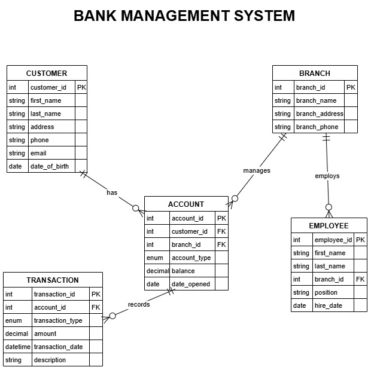

# Bank Management System

A simple web-based banking system built with Flask, MySQL, and Python. This application allows users to create accounts, check balances, deposit, withdraw, and transfer funds between accounts. It features a responsive UI with animated input labels and flash messages for feedback.

## ER Diagram for BANK MANAGEMENT SYSTEM

## Features
- **Account Creation**: Create a new account for existing or new customers with details like branch, account type, and initial balance.
- **Balance Check**: View the current balance of an account by entering its ID.
- **Transactions**: Perform deposits, withdrawals, and transfers between accounts.
- **Responsive Design**: Adapts to various screen sizes (desktop, tablet, mobile).
- **Database Integration**: Uses MySQL to store customer, account, and transaction data.
- **Flash Messages**: Provides user feedback for successful or failed operations.

## Tech Stack
- **Backend**: Flask (Python)
- **Database**: MySQL
- **Frontend**: HTML, CSS (custom styles), Jinja2 templating
- **Environment Management**: `python-dotenv` for `.env` file
- **Dependencies**: `mysql-connector-python`, `flask`
